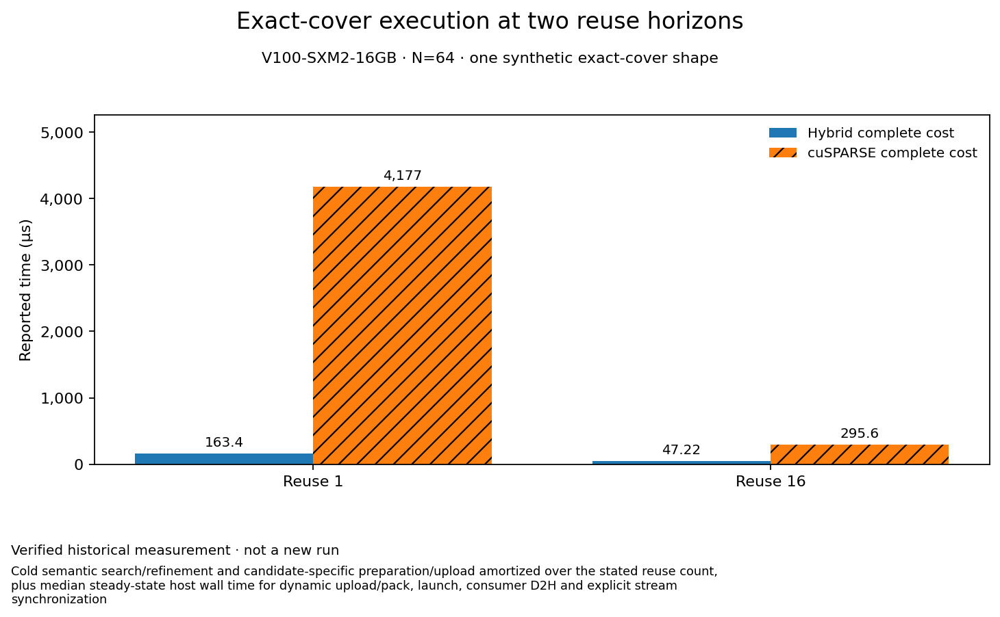

# Exact-cover execution at two reuse horizons

**Evidence state:** verified historical

When does a prepared hybrid cover pay for its construction?

For one deterministic synthetic N=64 exact-cover fixture on the reported Tesla V100-SXM2, the historically recorded hybrid complete cost was lower than the measured cuSPARSE N64 FP32 path at reuse 1 (163,427 vs 4,176,523 ns) and reuse 16 (47,221.062 vs 295,570.188 ns). This supports only this exact-cover regime; it is not a universal layout or biological-performance claim.

| Case | Hybrid complete cost (ns) | cuSPARSE complete cost (ns) |
|---|---:|---:|
| Reuse 1 | 163427 | 4176523 |
| Reuse 16 | 47221.062 | 295570.188 |

## What was measured

**Scope:** Cold semantic search/refinement and candidate-specific preparation/upload amortized over the stated reuse count, plus median steady-state host wall time for dynamic upload/pack, launch, consumer D2H and explicit stream synchronization. **Statistic:** Cold cost / reuse + median of 11 steady-state samples; the aggregate record also reports relative MAD. **Uncertainty:** Relative MAD in the aggregate gate record: hybrid 1.507%, sparse 0.741%. Individual samples and confidence intervals are unavailable.

**Hardware:** Tesla V100-SXM2-16GB / sm_70 (reported)

**Precision:** Hybrid relation values and RHS are FP16 with FP32 accumulation/output; cuSPARSE relation and RHS are FP32. Both reported zero max absolute error against the same FP32 reference on this fixture.

**Warmups:** 3

**Repeats:** 11

**Toolchain:** CUDA toolkit, driver, and cuSPARSE versions were not captured in the portable gate record.

**Measurement order:** Each timed iteration measured hybrid first, then cuSPARSE; this fixed order was not randomized.

## Interpretation and limits

- One deterministic synthetic shape on Tesla V100-SXM2-16GB / sm_70: 2,176 logical edges, 2,048 MMA edges and 128 residual edges. It does not establish biological or held-out generalization.
- The hybrid uses FP16 relation values and RHS with FP32 accumulation/output; the comparator uses FP32 relation values and RHS. Both had zero max absolute error versus the same FP32 host reference on this fixture, but this does not establish accuracy across other numerical regimes.
- The complete-cost calculation is cold preparation amortized over reuse plus a median steady-state caller-visible phase. It includes the recorded H2D/value packing, launch, output D2H and explicit synchronization. The result covers only reuse 1 and 16.
- The original JSONL is an aggregate gate record with one provenance row and two reuse rows. Each row summarizes 11 steady samples and reports relative MAD; individual sample timings are not present, so no confidence interval can be reconstructed.
- CUDA toolkit, driver and cuSPARSE versions, GPU UUID, and standalone command-level output samples are not present in the portable record.
- Within each of 11 measured iterations, hybrid ran before cuSPARSE; the campaign used this fixed order and did not randomize candidate order.

## Reproduce / inspect

Historical gate command: `python bench/tensor_core/ce_geo/run_hybrid_forward.py --output /tmp/ce_geo_sm70_forward_complete_cost.jsonl`. It builds with nvcc `-arch=sm_70 -O3`, runs 3 warmups and 11 repeats, and validates through `bench/ce_geo/harness/run.py`. The recorded CE-GEO-113-BENCH gate required `accelerator:any` and `cuda-benchmark-mutex`; this documentation pass did not rerun it.

[Original recorded explanation](../../bench/ce_geo/evidence/sm70_forward_disposition.json) · observed 2026-09-29 at `e4135674446ab9e32717f8b5ade04c1c3648326a`.

Measurement source: `2fe2db329af1430fb52cf3677bb34be9e97a4216` (different from the current document-read revision where stated).

Observed source-file identity: `e09e263a3b82bcbd06f9008a618a5184dd141928af54d1fef67dec54642bada4`.

Portable evidence: [ce-exact-cover-gate-evidence.jsonl](../../docs/results/data/ce-exact-cover-gate-evidence.jsonl), [ce-exact-cover-evidence-manifest.json](../../docs/results/data/ce-exact-cover-evidence-manifest.json).

[Chart/table input](data/ce-exact-cover.json) · [All selected results](index.md)
